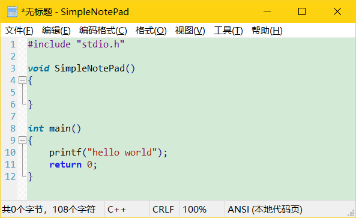

# SimpleNotePad

这是一个可以代替Windows记事本的软件，除了包含记事本原有的功能外，还支持各种编程语言的语法高亮，还有编码格式转换、十六进制查看编辑、文件二进制比较、编码批量转换的功能。

## 主要特性：

* 支持各种编程语言的语法高亮
* 支持ANSI、UTF8、UTF16及多种编码字符集之间的自由切换和转换
* 编码格式自动识别
* 代码折叠
* 剪贴板历史记录
* 增强的查找和替换
* 标记所有匹配
* 自动标记所有选中标识符
* 添加/删除注释
* 大小写转换
* 十六进制查看功能
* 文件二进制比较功能
* 文本编码转换和文件编码批量转换功能

## 下载链接：

请[点击此处](https://github.com/zhongyang219/SimpleNotePad/releases/latest)下载SimpleNotePad的最新版本。

